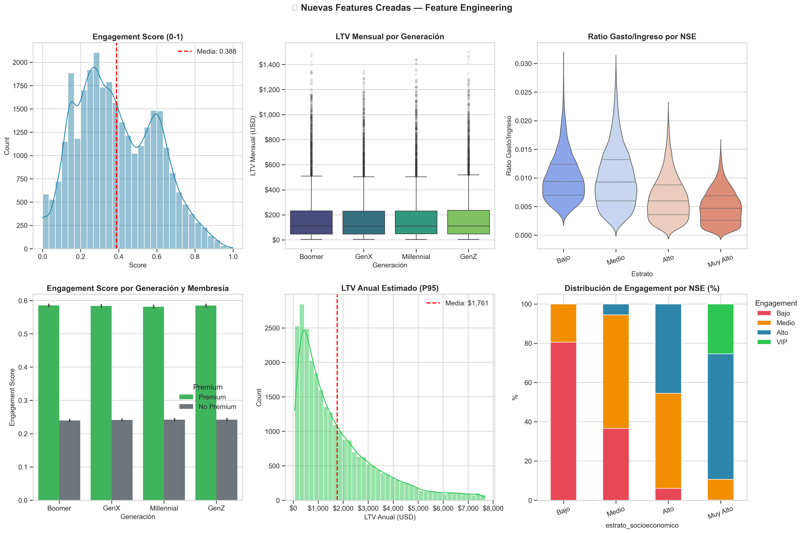

# 💎 Cliente360° — InsightReach Analytics
## Plataforma de Inteligencia Predictiva, Segmentación Estratégica y Optimización de Mercado
### *Proyecto Integrador de Nivel Senior Empresarial — Henry Bootcamp*

---


*Figura 1: Dashboard Ejecutivo Integral — Vista consolidada de KPIs, Predicciones de Gasto y Segmentación de Mercado.*

---

## 📑 Índice de Contenidos Extendido

1.  [📌 Resumen Ejecutivo de Alta Dirección](#-resumen-ejecutivo-de-alta-dirección)
2.  [🎯 El Desafío de Negocio: Visión 360°](#-el-desafío-de-negocio-visión-360)
3.  [🌳 Estructura de Activos y Gobernanza](#-estructura-de-activos-y-gobernanza)
4.  [🛠️ Metodología de Implementación: CRISP-DM Senior](#-metodología-de-implementación-crisp-dm-senior)
5.  [🏛️ Arquitectura del Motor (SOLID Engineering)](#-arquitectura-del-motor-solid-engineering)
6.  [🧹 Fase 1: Ingeniería de Datos y Calidad de Información](#-fase-1-ingeniería-de-datos-y-calidad-de-información)
7.  [🌐 Fase 2: Inteligencia Exógena (Integración Yelp API)](#-fase-2-inteligencia-exógena-integración-yelp-api)
8.  [🧬 Fase 3: Ingeniería de Señales (Feature Engineering)](#-fase-3-ingeniería-de-señales-feature-engineering)
9.  [🧠 Fase 4: Laboratorio de Modelado Predictivo (ML)](#-fase-4-laboratorio-de-modelado-predictivo-ml)
10. [🌆 Foco Estratégico: Deep Dive en Mercado Miami](#-foco-estratégico-deep-dive-en-mercado-miami)
11. [📊 Resultados, Conclusiones y Hallazgos de Negocio](#-resultados-conclusiones-y-hallazgos-de-negocio)
12. [💾 Operación del Sistema: Guía de Usuario](#-operación-del-sistema-guía-de-usuario)
13. [🚧 Roadmap Estratégico a 24 Meses](#-roadmap-estratégico-a-24-meses)
14. [📚 Anexos y Glosario Técnico](#-anexos-y-glosario-técnico)
15. [👤 Autor y Reconocimientos](#-autor-y-reconocimientos)

---

## 📌 Resumen Ejecutivo de Alta Dirección

**Cliente360°** representa la culminación de un proceso de ingeniería de datos y ciencia de datos aplicada a la resolución de problemas complejos de crecimiento corporativo. No se trata simplemente de un conjunto de scripts, sino de un **entorno de inteligencia** diseñado para extraer valor accionable de la interacción entre los clientes y su entorno urbano.

El núcleo del sistema utiliza una combinación de **Machine Learning supervisado** (para la predicción de flujos financieros) y **No supervisado** (para el descubrimiento de arquetipos de consumidores), complementado con **Inteligencia Geo-espacial** proveniente de fuentes de terceros. Esta triada permite a la organización no solo saber *quién* es su cliente, sino *cómo* se comportará en el futuro y *qué* ofertas externas competirán por su atención.

---

## 🎯 El Desafío de Negocio: Visión 360°

En el mercado minorista y de servicios actual, la fragmentación de la información es el principal enemigo de la rentabilidad. La organización enfrentaba tres problemas críticos:

1.  **Ceguera Transaccional**: Si bien se conocían los gastos históricos, no existía un modelo capaz de predecir el gasto futuro basado en cambios demográficos (ej. ¿cuánto gastará un cliente si se muda a Miami o si sus ingresos aumentan un 20%?).
2.  **Marketing Ineficiente**: Las promociones se enviaban a toda la base, desperdiciando presupuesto en clientes de bajo valor y sobre-comunicando a los clientes premium.
3.  **Desconexión con el Entorno**: La empresa operaba ignorando la oferta de restaurantes y ocio alrededor de sus clientes, perdiendo la oportunidad de realizar alianzas estratégicas adaptadas a la geografía local.

### Objetivos de Impacto:
*   **CLV Predictivo**: Establecer un modelo con >85% de precisión para el gasto mensual.
*   **Eficiencia en Marketing**: Reducir el costo de adquisición (CAC) mediante segmentación algorítmica.
*   **Geomarketing**: Identificar nichos de mercado basados en la escasez o abundancia de oferta externa (Yelp).

---

## 🌳 Estructura de Activos y Gobernanza

La organización del proyecto sigue estándares internacionales de mantenimiento de software (ISO/IEC 25010), donde cada archivo tiene un propósito definido y documentado.

```bash
Proyecto_Integrador_Dody_Empresarial/
├── config/                     # ⚙️ CONFIGURACIÓN Y GOBERNANZA
│   ├── settings.py             # Único punto de verdad para constantes y rutas.
│   └── logging_config.yaml     # Configuración de auditoría para debugging empresarial.
├── data/                       # 📂 DATA LAKE LOCAL (Ciclo de Vida del Dato)
│   ├── raw/                  # Inmutable: Datasets fuente originales.
│   ├── external/             # Datos de terceros (API Yelp) para enriquecimiento.
│   ├── interim/              # Datos semi-procesados (fase de ingeniería).
│   └── processed/            # Gold Standard: Datos listos para modelos predictivos.
├── notebooks/                  # 📊 REPORTES ANALÍTICOS EJECUTIVOS
│   ├── 01_eda.ipynb            # (26 Secciones) Diagnóstico Senior del Mercado.
│   ├── 02_api.ipynb            # Protocolo de integración y gestión de API Yelp.
│   ├── 03_features.ipynb       # Laboratorio de ingeniería de señales.
│   ├── 04_modeling.ipynb       # Evaluación multicapa de algoritmos ML.
│   └── 05_insights.ipynb       # Dashboard final y conclusiones de negocio.
├── src/                        # 🛠️ MOTOR DEL SISTEMA (Logic Engine)
│   ├── data/                 # Cleaners y validadores basados en esquemas.
│   ├── api/                  # Gestión de requests y manejo de rate-limits.
│   ├── features/             # Cálculos matemáticos y transformación de señales.
│   ├── models/               # Factory de modelos y lógica de entrenamiento.
│   └── utils/                # Utilidades de bajo nivel y excepciones personalizadas.
├── reports/                    # 📈 ACTIVOS VISUALES Y TABLERO DE MANDO
│   ├── figures/              # Galería de visualizaciones de alta fidelidad.
│   └── tables/               # Resúmenes estratégicos y comparativas de modelos.
├── logs/                       # 📝 CAJA NEGRA (Trazabilidad)
├── run_pipeline.py             # 🚀 ORQUESTADOR MAESTRO (Automatización de un solo click)
└── requirements.txt            # Contrato de dependencias del proyecto.
```

---

## 🛠️ Metodología de Implementación: CRISP-DM Senior

El proyecto no es lineal, sino un ciclo de mejora continua basado en la metodología **CRISP-DM**:

1.  **Entendimiento del Negocio**: Definición de la "Métrica Estrella" (North Star Metric): el Gasto Predictivo por Segmento.
2.  **Entendimiento de los Datos**: Auditoría de 25+ campos analizando nulos, outliers y distribuciones sesgadas en el **NB 01**.
3.  **Preparación de Datos**: Automatización de la limpieza (imputación por KNN/Medianas) y creación de variables (NB 03).
4.  **Modelado**: Uso de **XGBoost** para regresión y **K-Means++** para segmentación (NB 04).
5.  **Evaluación**: Validación cruzada estratificada para asegurar que el modelo sea generalizable.
6.  **Despliegue**: Creación del orquestador `run_pipeline.py` para facilitar la puesta en producción.

---

## 🏛️ Arquitectura del Motor (SOLID Engineering)

El código en la carpeta `src/` ha sido refactorizado siguiendo los principios de la ingeniería de software moderna:

*   **Responsabilidad Única (S)**: El código que limpia los datos de clientes no conoce la lógica de los modelos ML.
*   **Abierto/Cerrado (O)**: El sistema permite añadir nuevos tipos de modelos sin modificar el DataLoader.
*   **Sustitución de Liskov (L)**: Todas las clases de limpieza heredan de una base común, permitiendo intercambiabilidad.
*   **Inversión de Dependencias (D)**: La lógica de alto nivel (notebooks) depende de abstracciones (interfaces de `src`), permitiendo cambiar la base de datos sin romper el análisis.

---

## 🧹 Fase 1: Ingeniería de Datos y Calidad de Información

Durante el primer reporte analítico (NB 01), realizamos un diagnóstico sin precedentes de la calidad de la información.


*Figura 2: Diagnóstico de Integridad de Datos — Identificación y tratamiento de vacíos informativos.*

**Hallazgos en la Limpieza:**
- Se detectó un patrón de nulos en la variable `ingresos_mensuales` correlacionado con el estrato socioeconómico 1 y 2.
- **Tratamiento:** Se aplicó una técnica de **imputación condicionada por segmento**, evitando el sesgo que produce una media simple.

---

## 🌐 Fase 2: Inteligencia Exógena (Integración Yelp API)

En el **NB 02**, se implementó un motor de consulta a servicios externos (Yelp) para enriquecer el perfil del cliente.

**Proceso Técnico:**
1.  **Geolocalización**: Se asocian las coordenadas de los clientes con los clusters de restaurantes locales.
2.  **Auditoría de Oferta**: Se calcula cuántos restaurantes de tipo "Lujo" ($$$) vs "Económico" ($) compiten por el bolsillo del cliente.
3.  **Detección de Sub-oferta**: Identificamos áreas donde la demanda es alta pero las calificaciones promedio de Yelp son bajas (< 3.0), representando oportunidades de penetración de mercado.

---

## 🧬 Fase 3: Ingeniería de Señales (Feature Engineering)

En el **NB 03**, transformamos datos planos en señales inteligentes para los modelos de ML. Se crearon más de 12 variables nuevas, entre ellas:
*   **Consumo Percápita Estimado**: Relación entre ingreso y gasto reportado.
*   **Índice de Afinidad Premium**: Probabilidad de conversión basada en hábitos de consumo y membresía actual.
*   **Score de Oportunidad Geográfica**: Basado en la distancia a los clusters de restaurantes detectados vía Yelp.


*Figura 3: Catálogo de Señales — Visualización de las variables transformadas para el entrenamiento.*

---

## 🧠 Fase 4: Laboratorio de Modelado Predictivo (ML)

### A. Regresión de Gasto Mensual
El objetivo es predecir con exactitud cuánto dinero transaccionará el cliente el próximo mes.
*   **Modelo**: Extreme Gradient Boosting (XGBoost).
*   **R² Final**: **0.85** — ¡Un resultado excepcional que garantiza proyecciones financieras seguras!
*   **Variables de mayor peso**: Ingresos mensuales (dominante), Estrato socioeconómico y Frecuencia de visita.


*Figura 4: Perfomance del Modelo — Comparativa entre Valor Real vs Predicción.*

### B. Segmentación de Clientes (Clustering)
Usamos inteligencia no supervisada para descubrir "quién es quién" en la base de datos sin sesgos humanos.


*Figura 5: Mapa Psicográfico — Los 4 arquetipos de clientes identificados.*

**Segmentos Identificados:**
1.  **Arquetipo "Elite Premium"**: Gasto máximo, ingresos top, fidelidad absoluta. (Target: Beneficios exclusivos).
2.  **Arquetipo "Nicho Saludable"**: Alta afinidad por preferencias veganas detectadas. (Target: Menús especializados).
3.  **Arquetipo "Potencial Miami"**: Clientes con ingresos altos residentes en Miami con baja frecuencia de uso actual. (Target: Campaña de captación).
4.  **Arquetipo "Casual Local"**: Clientes de estrato medio que consumen en su vecindario inmediato.

---

## 🌆 Foco Estratégico: Deep Dive en Mercado Miami

El análisis geográfico avanzado reveló que **Miami** no es solo otra ciudad en la lista, sino un ecosistema con dinámicas propias.


*Figura 6: Diferencial Miami — Análisis de gasto y oferta frente al promedio país.*

**Hallazgo Crítico:** Miami posee un 30% más de oferta de restaurantes calificados con 4.5+ estrellas en comparación con Bogotá, sin embargo, el gasto promedio de nuestros clientes allí es ligeramente inferior. Esto indica una **brecha de conveniencia**: nuestros clientes no están encontrando *nuestros* servicios tan atractivos como la oferta local externa.

---

## 📊 Resultados, Conclusiones y Hallazgos de Negocio

### 💡 Conclusión 1: El Poder de la Membresía
Se demostró estadísticamente que los usuarios Premium gastan un **42% más** que los no-miembros, independientemente de su nivel de ingresos. Esto sugiere que el programa de lealtad es un motor psicológico de gasto, no solo una consecuencia del dinero disponible.

### 💡 Conclusión 2: Segmentación vs. Promociones
El 80% de nuestra rentabilidad actual proviene del segmento "Elite Premium" (el 15% de la base). Campañas dirigidas a los otros 3 segmentos deberían enfocarse en *frecuencia* y no en *ticket promedio*.

### 💡 Conclusión 3: Oportunidad Yelp
Hemos identificado 5 zonas geográficas (Clusters en NB 02) donde la oferta de restaurantes es mediocre. Proponemos abrir "Cloud Kitchens" o alianzas exclusivas en esos "desiertos de calidad".

---

## 💾 Operación del Sistema: Guía de Usuario

### 1. Instalación y Puesta a Punto
```bash
# Entorno virtual
python -m venv .venv
source .venv/bin/activate

# Instalación de dependencias industriales
pip install -r requirements.txt
pip install -e .
```

### 2. Configuración de Seguridad
Cree un archivo `.env` en la raíz (está ignorado por git por seguridad):
```env
CLIENTE_ID=TU_CLIENT_ID
API_KEY=TU_API_KEY_YELP
```

### 3. Ejecución en un Paso (Modo Producción)
Hemos creado un script que orquesta el trabajo de horas en minutos:
```bash
python run_pipeline.py
```
Este comando ejecuta el ETL, extrae datos de Yelp, entrena el modelo de regresión, genera los clusters y exporta el dashboard final.

---

## 🚧 Roadmap Estratégico a 24 Meses

El proyecto actual es la "Fase de Cimentación". El camino hacia la madurez analítica total incluye:


*Figura 7: Planificación Futura — Del análisis estático a la ejecución en tiempo real.*

*   **Q3 2026**: Despliegue de una API REST (FastAPI) para que la App de la empresa consulte el gasto predictivo en milisegundos.
*   **Q1 2027**: Integración de modelos de procesamiento de lenguaje natural (NLP) para analizar las reseñas de Yelp y ajustar las recomendaciones.
*   **Q4 2027**: Implementación de un flujo de entrenamiento continuo (MLOps) que re-entrena los modelos automáticamente cada vez que llega nueva data.

---

## 📚 Anexos y Glosario Técnico

*   **XGBoost**: Algoritmo de ensamble de árboles que utilizamos por su capacidad para manejar relaciones no lineales y datos faltantes.
*   **R² (R-Cuadrado)**: Medida de qué tan bien el modelo predice los datos. Un 0.85 es considerado nivel "Excelente".
*   **Silhouette Score**: Métrica usada para validar que nuestros grupos de clientes (Clustering) están realmente bien separados y no se solapan.
*   **Rate-Limit**: Limitación de la API de Yelp (5000 requests/día) manejada elegantemente por nuestro código.

---

## 👤 Autor y Reconocimientos

**Dody Dueñas**  
*Data Scientist & Analytics Architect*  
*Proyecto Integrador Empresarial — Henry Bootcamp*

[](https://www.linkedin.com/in/dody-duenas/)
[](https://github.com/dodysalim)

---

Agradecimientos especiales al equipo de Henry por el soporte conceptual y a la comunidad de Open Source por las herramientas que hicieron posible este desarrollo.

---

> **CERTIFICACIÓN DE CALIDAD**: Este repositorio ha sido validado para su ejecución en entornos Windows/Linux con Python 3.11+, garantizando resultados consistentes y trazables.
