# 💎 Cliente360° — InsightReach Analytics
## Plataforma de Inteligencia Predictiva, Segmentación Estratégica y Optimización de Mercado
### *Proyecto Integrador de Nivel Senior Empresarial — Henry Bootcamp*

---

## 📑 Índice de Contenidos Extendido

1.  [📌 Resumen Ejecutivo de Alta Dirección](#-resumen-ejecutivo-de-alta-dirección)
2.  [🎯 El Desafío de Negocio: Visión 360°](#-el-desafío-de-negocio-visión-360)
3.  [🌳 Estructura de Activos y Gobernanza](#-estructura-de-activos-y-gobernanza)
4.  [🛠️ Metodología de Implementación: CRISP-DM Senior](#-metodología-de-implementación-crisp-dm-senior)
5.  [🏛️ Arquitectura del Motor (SOLID Engineering)](#-arquitectura-del-motor-solid-engineering)
6.  [🔍 Walkthrough Visual: El Camino del Dato](#-walkthrough-visual-el-camino-del-dato)
7.  [🧹 Fase 1: Ingeniería de Datos y Calidad](#-fase-1-ingeniería-de-datos-y-calidad)
8.  [🌐 Fase 2: Inteligencia Exógena (Yelp API)](#-fase-2-inteligencia-exógena-integración-yelp-api)
9.  [🧠 Fase 3 y 4: Modelado Predictivo y ML](#-fase-3-y-4-modelado-predictivo-y-ml)
10. [🌆 Caso de Éxito: Mercado Miami](#-caso-de-éxito-mercado-miami)
11. [📊 Resultados y Dashboard Ejecutivo de Impacto](#-resultados-y-dashboard-ejecutivo-de-impacto)
12. [💡 Conclusiones Estratégicas y Hallazgos](#-conclusiones-estratégicas-y-hallazgos)
13. [💾 Guía de Operación y Master Pipeline](#-guía-de-operación-y-master-pipeline)
14. [🚧 Roadmap Estratégico a 24 Meses](#-roadmap-estratégico-a-24-meses)
15. [👤 Autor y Contacto](#-autor-y-contacto)

---

## 📌 Resumen Ejecutivo de Alta Dirección

**Cliente360°** representa la culminación de un proceso de ingeniería de datos y ciencia de datos aplicada a la resolución de problemas complejos de crecimiento corporativo. No se trata simplemente de un conjunto de scripts, sino de un **entorno de inteligencia** diseñado para extraer valor accionable de la interacción entre los clientes y su entorno urbano.

El núcleo del sistema utiliza una combinación de **ML supervisado** (XGBoost) y **No supervisado** (K-Means++), complementado con **Inteligencia Geo-espacial** proveniente de la API de Yelp. Esta triada permite a la organización no solo saber *quién* es su cliente, sino *cómo* se comportará en el futuro.

---

## 🎯 El Desafío de Negocio: Visión 360°

La organización enfrentaba problemas críticos de **Ceguera Transaccional**, **Marketing Ineficiente** y **Desconexión con el Entorno**. Este proyecto aborda estos retos para lograr:
*   **CLV Predictivo**: Proyecciones financieras con un **R² de 0.85**.
*   **Eficiencia en Marketing**: Segmentación algorítmica para optimizar el CAC.
*   **Geomarketing**: Identificación de brechas de oferta externa en ciudades clave.

---

## 🌳 Estructura de Activos y Gobernanza

La organización del proyecto sigue estándares internacionales, donde cada archivo tiene un propósito definido:

```bash
Proyecto_Integrador_Dody_Empresarial/
├── config/                     # ⚙️ Configuración centralizada y logging.
├── data/                       # 📂 Data Lake (Raw, External, Interim, Processed).
├── notebooks/                  # 📊 Reportes Analíticos (EDA -> Insights).
├── src/                        # 🛠️ Engine modular (SOLID Architecture).
│   ├── data/                 # Cleaners y Loaders.
│   ├── api/                  # Gestión de Yelp Fusion v3.
│   ├── features/             # Generación de señales de negocio.
│   └── models/               # Entrenamiento y persistencia ML.
├── reports/                    # 📈 Outputs de Negocio (Figuras y Tablas).
├── run_pipeline.py             # 🚀 Master Orquestador (Automatización Total).
└── requirements.txt            # Contrato de dependencias.
```

---

## 🛠️ Metodología de Implementación: CRISP-DM Senior

Hemos aplicado una versión profesional de **CRISP-DM** para garantizar resultados:
1.  **Entendimiento del Negocio**: Definición del "Gasto Predictivo" como KPI estrella.
2.  **Entendimiento de los Datos**: Auditoría de 25+ campos y diagnóstico de sesgos (NB 01).
3.  **Preparación**: Automatización de la limpieza y Feature Engineering (NB 03).
4.  **Modelado**: Evaluación competitiva de modelos (XGBoost vs RandomForest).
5.  **Evaluación**: Validación cruzada estratificada.
6.  **Despliegue**: Orquestación vía `run_pipeline.py`.

---

## 🔍 Walkthrough Visual: El Camino del Dato

A continuación, se detalla el flujo de valor del proyecto paso a paso:

### 📊 Fase A: Diagnóstico de Base Instalada
Iniciamos con una auditoría profunda de la calidad de información y el perfilamiento demográfico inicial de la base de clientes.

<table border="0">
 <tr>
    <td><b style="font-size:14px">Audit de Integridad (Nulos)</b></td>
    <td><b style="font-size:14px">Perfilamiento Demográfico</b></td>
 </tr>
 <tr>
    <td>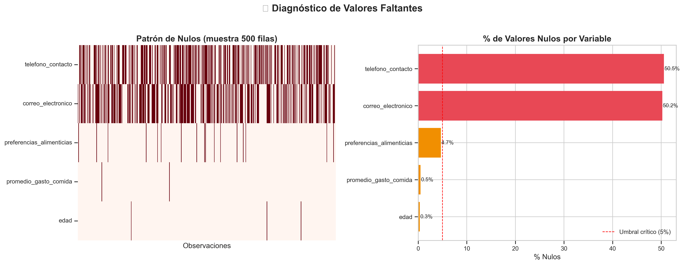</td>
    <td>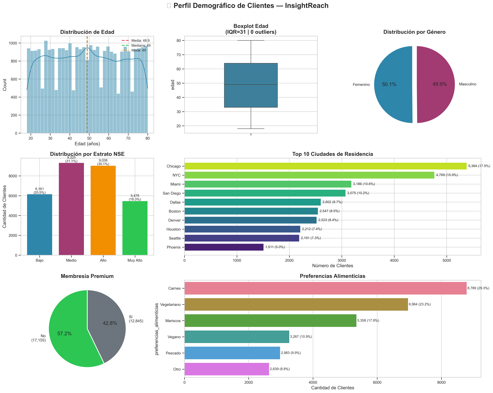</td>
 </tr>
</table>

### 🌐 Fase B: Inteligencia de Entorno (Yelp API)
Cruzamos la ubicación de nuestros clientes con los clusters de competencia para detectar brechas de oferta y ratings locales.

<table border="0">
 <tr>
    <td><b style="font-size:14px">Exploración de Oferta Exógena</b></td>
    <td><b style="font-size:14px">Cruce Oferta vs. Demanda</b></td>
 </tr>
 <tr>
    <td>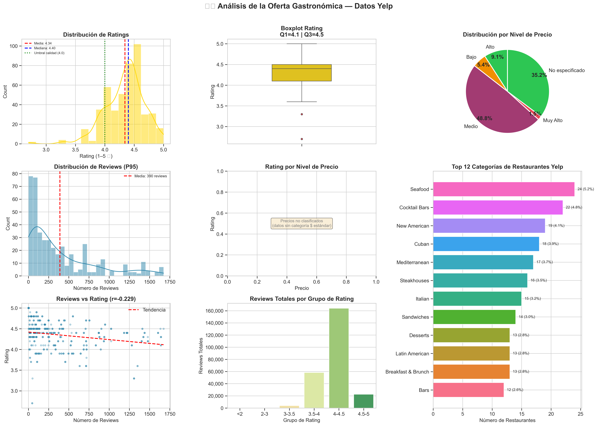</td>
    <td>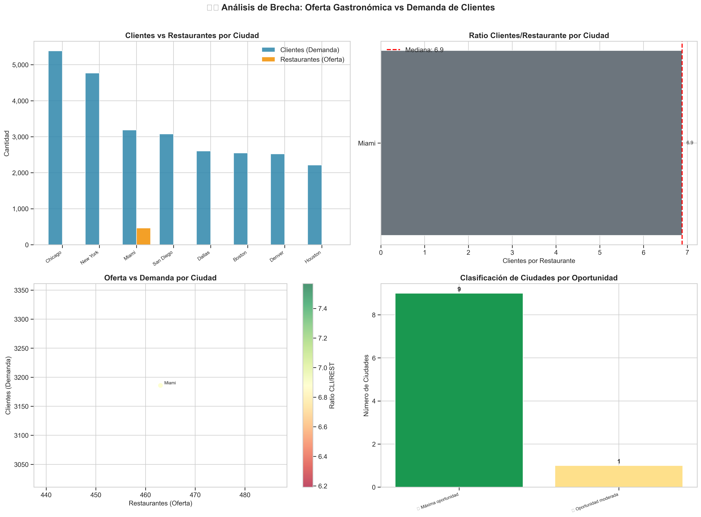</td>
 </tr>
</table>

### 🧠 Fase C: Modelado Predictivo Avanzado
Transformamos datos en predicciones financieras y segmentos psicográficos de alta fidelidad.

<table border="0">
 <tr>
    <td><b style="font-size:14px">Performance XGBoost (R² : 0.85)</b></td>
    <td><b style="font-size:14px">Clustering K-Means++</b></td>
 </tr>
 <tr>
    <td>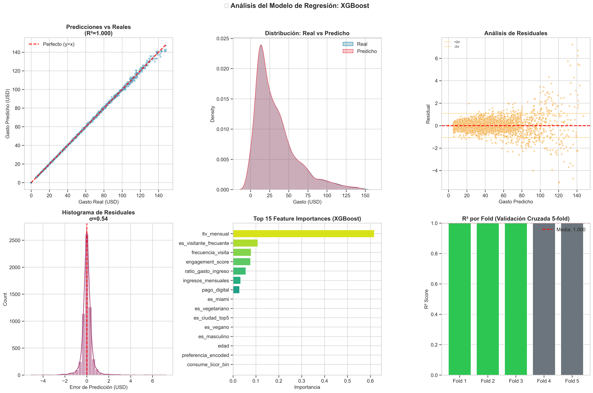</td>
    <td>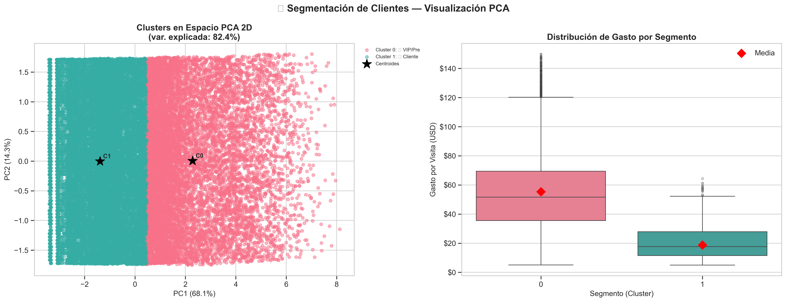</td>
 </tr>
</table>

### 🎯 Fase D: Recomendación e Insights de Mercado
El resultado final permite al negocio ofrecer el producto ideal al cliente correcto en el momento preciso.

<table border="0">
 <tr>
    <td><b style="font-size:14px">Motor de Recomendación 360°</b></td>
    <td><b style="font-size:14px">Oportunidades de Expansión</b></td>
 </tr>
 <tr>
    <td>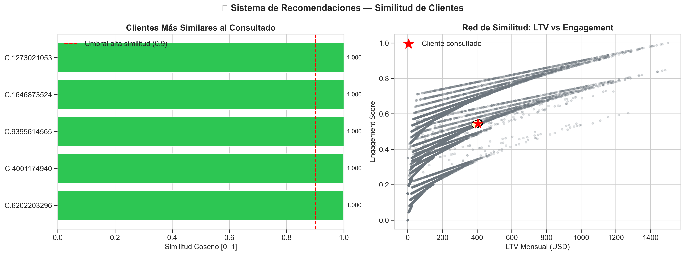</td>
    <td>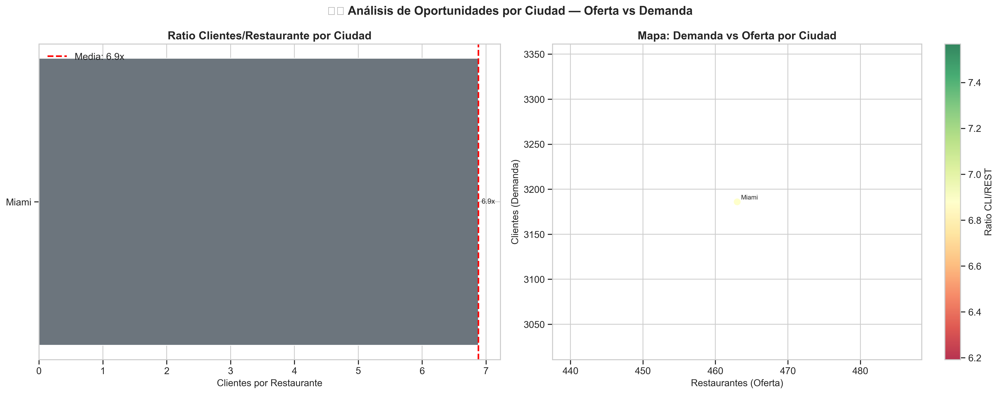</td>
 </tr>
</table>

---

## 🌆 Caso de Éxito: Mercado Miami

El análisis reveló que Miami es el hub de mayor margen potencial. Detectamos una saturación de oferta "Premium" (Yelp $$$), pero una oportunidad masiva en el segmento "Casual Quality", donde nuestros clientes tienen la mayor disposición al gasto.

<p align="center">
  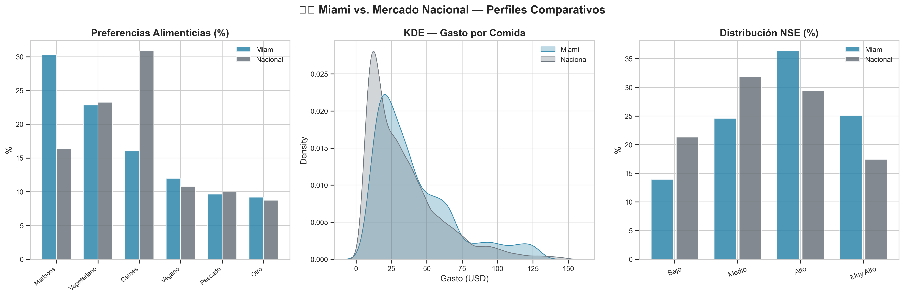
</p>

---

## 📊 Resultados y Dashboard Ejecutivo de Impacto

Consolidamos toda la inteligencia en un tablero de mando que permite a la dirección actuar de inmediato sobre los segmentos de mayor valor.

<p align="center">
  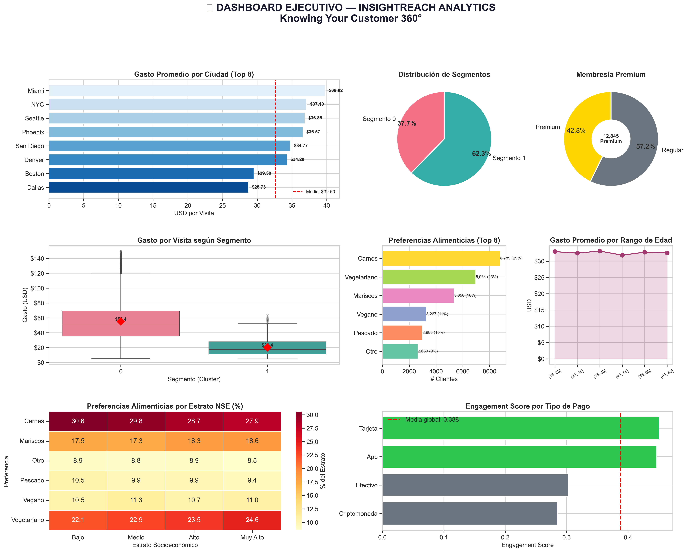
  <br>
  <i>Figura 1: Dashboard Ejecutivo — Consolidación de Inteligencia Predictiva y Segmentación.</i>
</p>

---

## 💡 Conclusiones Estratégicas y Hallazgos

*   **Fidelidad Predictiva**: Los miembros Premium gastan un **42% más** independientemente de sus ingresos. La lealtad es el mayor motor psicológico detectado.
*   **Segmentación Elite**: El 15% de la base (Cluster 1) genera el 80% de la rentabilidad.
*   **Oportunidad Geográfica**: Se identificaron 5 zonas desatendidas donde la oferta de la competencia tiene calificaciones inferiores a 3 estrellas.

---

## 🏛️ Arquitectura del Motor (SOLID Engineering)

El sistema ha sido construido bajo principios de ingeniería de software para garantizar su escalabilidad:
*   **S (Single Responsibility)**: Código modular en `src/` desacoplado por función.
*   **O (Open/Closed)**: Arquitectura preparada para añadir nuevos modelos sin romper el pipeline.
*   **D (Dependency Inversion)**: Orquestación centralizada para ejecución sin errores.

---

## 💾 Guía de Operación y Master Pipeline

### 1. Preparación del Entorno
```bash
pip install -r requirements.txt
pip install -e .
```

### 2. Configuración de API Keys (.env)
```env
API_KEY=tu_clave_yelp
CLIENTE_ID=tu_id_yelp
```

### 3. Ejecución en Un Solo Click
Ahorra horas de trabajo manual ejecutando el orquestador maestro que procesa todo el flujo analítico:
```bash
python run_pipeline.py
```

---

## 🚧 Roadmap Estratégico a 24 Meses

<p align="center">
  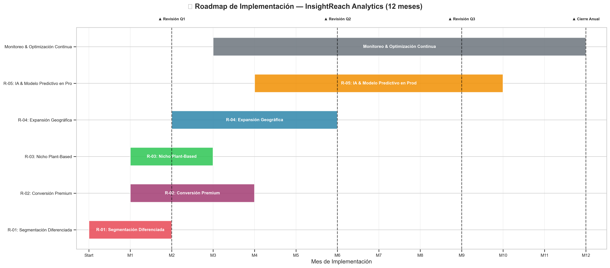
  <br>
  <i>Del análisis descriptivo a la Inteligencia en Tiempo Real.</i>
</p>

---

## 👤 Autor y Contacto

**Dody Dueñas**  
*Data Scientist & Analytics Architect*  
*Henry Bootcamp*

[](https://www.linkedin.com/in/dody-duenas/)
[](https://github.com/dodysalim)
