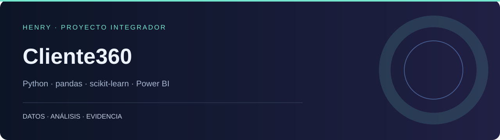

# Cliente360

**Limpieza, segmentación y modelos para explorar clientes y oportunidades de mercado.**

HENRY · PROYECTO INTEGRADOR · Python · pandas · scikit-learn · Power BI

[Portafolio](https://dodysalim.github.io/) · [Caso y alcance](docs/PORTFOLIO_CASE.md) · [Verificación](docs/VALIDATION.md)

## La pregunta

¿Qué perfiles aparecen entre los clientes y qué conclusiones permite realmente la cobertura de los datos?

## Qué puedes revisar

- ETL, ingeniería de características, regresión y clustering.
- Notebooks por etapa, comparativas de modelos y tablas procesadas.
- Informe ejecutivo y dashboard Power BI con cinco páginas.

## Inicio local

Usa Python 3.11 o 3.12 en un entorno independiente. Desde la raíz:

```bash
python -m venv .venv
# Windows: .venv\Scripts\activate
# macOS/Linux: source .venv/bin/activate
python -m pip install -r requirements.txt
```

Después de configurar los datos:

```bash
python -m pytest tests -q
# Para ejecutar los notebooks completos, con sus datos disponibles:
python run_pipeline.py
```

## Datos y configuración

Datos y resultados procesados presentes. La cobertura de Yelp utilizada en Power BI corresponde a Miami, con 200 establecimientos únicos; no permite comparar otras ciudades con Yelp.

## Power BI · PC y móvil

[Archivos e instrucciones](powerbi/README.md). Descarga el repositorio completo y abre `powerbi/Abrir-PowerBI.bat` en Windows; después pulsa **Actualizar**. Incluye A4 horizontal a tamaño real (100 %) y diseño móvil vertical. El archivo `.pbip` necesita sus carpetas Report, SemanticModel y data.

## Recorrido por el código

| Ruta | Qué contiene |
| --- | --- |
| [notebooks/](notebooks/) | Exploración y modelado |
| [src/](src/) | Componentes del pipeline |
| [data/processed/](data/processed/) | Resultados procesados |
| [reports/](reports/) | Tablas, figuras e informe |
| [tests/](tests/) | Pruebas de carga y regresión |

## Comprobación y alcance

Seis pruebas existentes aprobadas. Las tablas y el modelo Power BI se verificaron en la entrega de BI anterior.

No se volvió a ejecutar aquí la cadena completa de cinco notebooks. Los clientes son datos de formación; no se afirma impacto comercial realizado.

Para repetir las pruebas desde la raíz:

```bash
python -m pytest tests -q
```

## Autoría

Proyecto académico Henry. Dody Salim Dueñas Remache.

[Documentación anterior](docs/ORIGINAL_README.md), conservada como referencia histórica.
