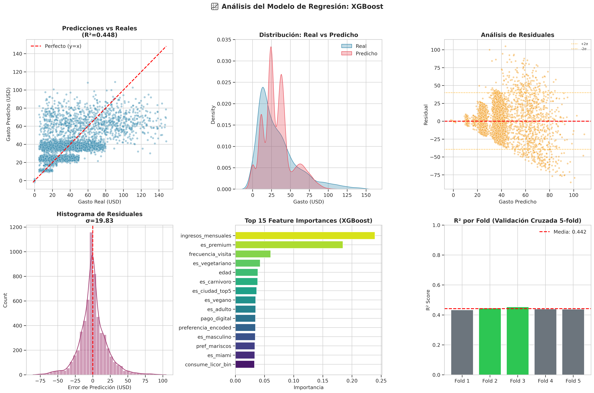
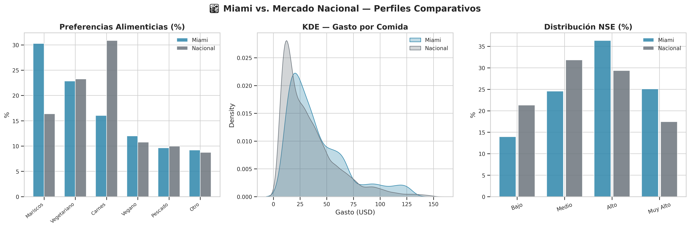
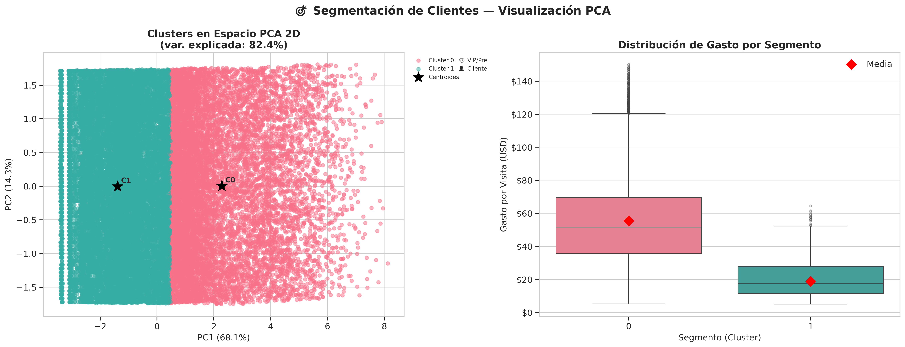

# 🏛️ Reporte de Conclusiones y Recomendaciones
## Proyecto: Cliente360° — InsightReach Analytics
### *Proyecto integrador del Módulo 1 de Henry (Data Science)*

---

## 📑 Resumen del Proyecto
Este reporte resume los hallazgos del pipeline analítico sobre **30,000 clientes** de restaurantes en EE. UU., enriquecido con **200 restaurantes únicos de Miami** obtenidos de la API de Yelp. Todos los números provienen de los notebooks `04_modeling` y `05_insights_and_recommendations`.

---

## 1. 📊 Hallazgos del Análisis

### 📈 Predicción del gasto por visita (XGBoost)
*   **R² = 0.45** en el set de prueba (validación cruzada 5-fold: 0.44 ± 0.01) y **error absoluto medio de USD 13.7**, frente a USD 20.4 si se predice siempre el promedio: un **33% menos de error**.
*   Las variables más útiles son los **ingresos mensuales** y la **frecuencia de visita**.
*   **Diferencial Premium**: los clientes con membresía gastan en promedio **USD 47.5 por visita, frente a USD 21.5** de los usuarios estándar (**+121%**).

> ⚠️ **Lección aprendida (fuga de datos):** la primera versión del modelo obtenía un R² de 0.9996 porque usaba como entradas `ltv_mensual` y `ltv_anual` (gasto × frecuencia), `ratio_gasto_ingreso` (gasto ÷ ingresos), `gasto_por_visita` y `engagement_score` (que incluye el gasto). Esas variables se calculan **a partir del valor que se quiere predecir**, así que se excluyeron. El R² de 0.45 es el rendimiento real.

*Figura 1: Predicción vs gasto real.*

### 🌆 Mercado de Miami (API de Yelp)
*   El **10.6%** de los clientes vive en Miami.
*   Los 200 restaurantes únicos de Miami obtenidos de Yelp (463 registros, porque cada local aparece en varias categorías) tienen un **rating promedio de 4.34** (σ = 0.34) y solo 3 están por debajo de 3.5 estrellas: es un mercado **competido y de buena calidad**, no de oferta deficiente.

*Figura 2: Comparativa Miami frente al promedio nacional.*

---

## 2. 🧠 Segmentación de Clientes (K-Means)
Se probaron de 2 a 9 clústeres. El mejor coeficiente de silueta se obtuvo con **k = 2 (0.39)**, lo que indica una separación moderada:

| Segmento | Clientes | Ingreso mensual | Gasto por visita | Visitas/mes | Valor mensual |
|---|---|---|---|---|---|
| 💎 **VIP / Premium** | 11,325 (38%) | USD 9,878 | USD 55.4 | 6.2 | USD 351 |
| 👤 **Cliente promedio** | 18,675 (62%) | USD 2,668 | USD 18.8 | 3.1 | USD 66 |

*   **El segmento VIP es el 38% de los clientes, pero genera el ~76% del valor mensual.**
*   La edad no diferencia a los segmentos (≈ 49 años en ambos): lo que los separa es el **poder adquisitivo y la frecuencia**.

*Figura 3: Segmentos de clientes.*

---

## 3. 🎯 Recomendaciones

- **Retener al segmento VIP:** concentra la mayor parte del valor. Conviene un programa de fidelización y alertas cuando baje su frecuencia de visita.
- **Convertir clientes a Premium:** los miembros gastan más del doble. Antes de escalar una campaña de prueba gratuita, hay que validar con un **A/B test** si la membresía *causa* más gasto o si solo la eligen quienes ya gastan más.
- **Miami:** al ser un mercado con oferta bien valorada, la estrategia debería ser de diferenciación (precio o experiencia) más que de "llenar un vacío".
- **Mejorar el modelo de gasto:** sumar variables de historial de compras (ticket anterior, categorías consumidas) para superar el R² de 0.45.

---

## 🏁 Conclusión General
El proyecto integra limpieza de datos, una API externa, feature engineering, regresión, clustering y un recomendador. Su principal aprendizaje técnico fue **detectar y corregir una fuga de datos** que inflaba el R² hasta 0.9996. Los resultados finales son más modestos, pero confiables.

---
**Autor: Dody Dueñas Remache**
